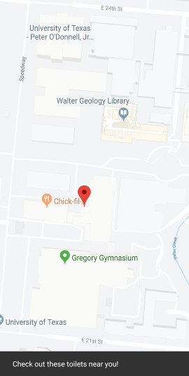
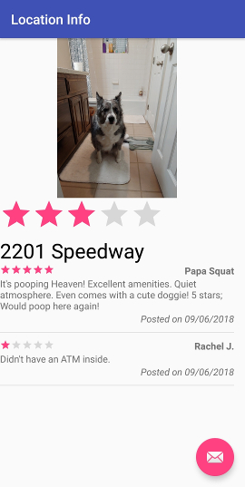

# Popasquat

### About

Popasquat is an Android application that allows users to view surrounding locations and select a restroom based on ratings.

Upon launch of the application, the user is greeted with a map where they can find markers on a map where ratings for a bathroom have been placed.

The user then has the ability to tap on any given marker to view ratings for a particular place, as well as see featured pictures and the address!

The application is currently in development and hence the source code is not available for publication. Check back here for more information when the application goes live on the Google Play Store!
